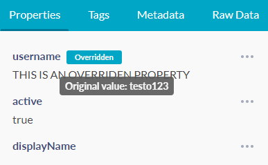

# JupiterOne 2020.47 Release

2020-06-16

In addition to the new features and updates below, check out
https://ask.us.jupiterone.io for the newly improved Question Library.

## New Features

- Added a **Compliance Evidence Library** to manage all uploaded evidence
  files/documents across all compliance standards from one central place. Each
  uploaded evidence can be attached to multiple compliance requirements, similar
  to how one query question can be mapped to many. 

- Brand new **Compliance Reporting** capability that allows users to configure a
  report template in Markdown and **generate a full PDF report** based on the
  status, risks, and other dynamic attributes of the selected compliance
  standard and organization data.

- In the compliance requirement view, a **Gap indicator** is added to next to
  each question, and each query tab within a question, as appropriate, to
  indicate which question/query identified gaps for the give requirement.

- Brand new **Powerup** capability to **Configure Resource Whitelisting**. The
  allowlisting is used to **enrich** a particular class of entities. Currently
  supported allowlisting includes:

  - **Approved Applications** - enriches `Application` entities with an
    `approved` boolean attribute

  - **Internal IP Addresses** - enriches mapped `Host` or `Network` entities
    with an `internal` boolean attribute

  - **Trusted External IP Addresses** - enriches mapped `Host` or `Network`
    entities with a `trusted` boolean attribute

- In the **Asset Inventory** app, **Bulk Upload** entities/relationships via
  JSON/YAML file will prompt the user for a `scope` (previously saved "scopes"
  are listed for easy selection).

  > What does "scope" mean? 
  >
  > A scope is used to identify relationships to update/delete during diffing.
  > Previously existing entities/relationships within the same scope that no
  > longer exist in the latest upload are deleted.

- Added an indicator in the entity properties panel to show any property value
  that has been manually edited/overriden by an administrator. The original
  value from the integration source / provider is shown on mouse hover.

  

- Added initial prompt for users to import Alert Rules upon first visit of the 
  Alerts app.

- Added shortcut button to see **Revision History** of each policy/procedure
  document in the **Policies** app.

## Integrations

- **Carbon Black**: Added alert findings ingestion.

  > IMPORTANT: The new release of the Carbon Black integration uses their latest
  > v6 API and it requires a change in API permission settings.
  >
  > **Please obtain new credentials and update the integration configuration in JupiterOne.**
  >
  > The instructions are found in the doc [here](../docs/integrations/cbdefense/index.md).

- **Carbon Black, Cisco AMP, Cisco Meraki, Jamf, Snipe-IT**: Improvements across
  multiple endpoint protection / endpoint management integrations to better
  correlate and normalize data so that they consistently point to the same
  device.

- Properly handle capturing of RAW data with the new integration SDK.

- Various small bug fixes and improvements.

> We are actively working on CloudTrail events support! Nothing in this release
> yet but may be ready for beta testing as soon as the next release! Stay tuned.

## Improvements and Bug Fixes

- A few mapper improvements and bug fixes.

- A few query and indexer improvements and bug fixes.
