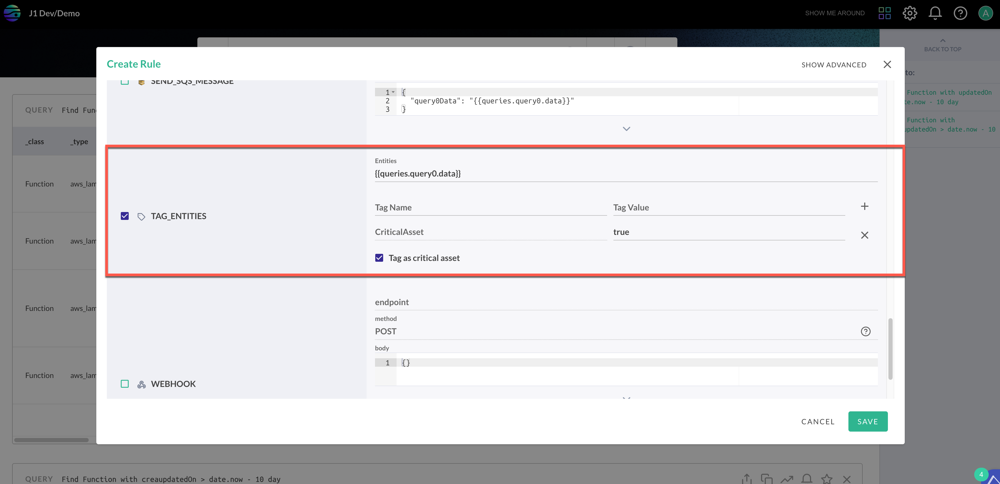
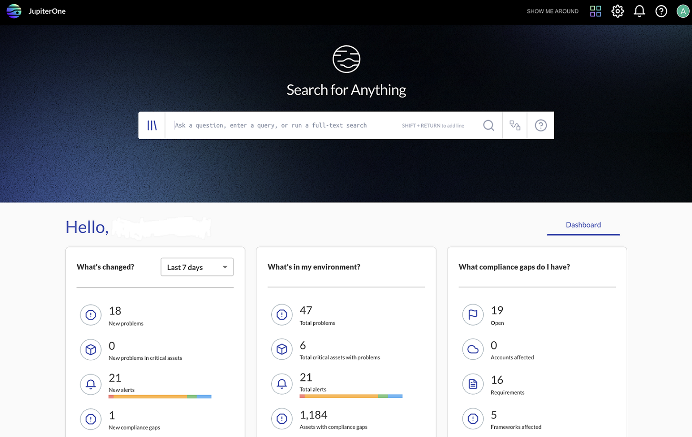

# JupiterOne 14 April 2022 Critical Assets Release

## April 14, 2022

## New Feature 
The J1 critical assets feature is now generally available. The critical assets feature enables you to quickly view and manage any risk related to the most important assets in your infrastructure.

This update inlcudes the ability to:
- Define your critical assets in J1 Assets by [customizing your critical assets] (https://community.askj1.com/kb/articles/799-using-filters-in-the-asset-inventory-app).
- Use J1QL to define more complex methods of identifying your critical assets by using the new alert rule action, "Tag Entities".

- Import rules from a critical assets rule pack that provides you alerts for when critical assets have been directly exposed to the internet or allowed access to everyone, for when new critical assets have been identified in the past 24 hours, or for when critical assets have been deleted in the past 24 hours.
- View problems such as compliance gaps or alerts associated with your critical assets on the key metrics dashboard in J1 Search.

- Monitor your critical assets with the Critical Asset Attack Surface Insights dashboard that provides visibility to your critical assets that are indirectly connected to the internet or allowing access to everyone, inclusive of the potential attack paths that could expose these critical assets.
