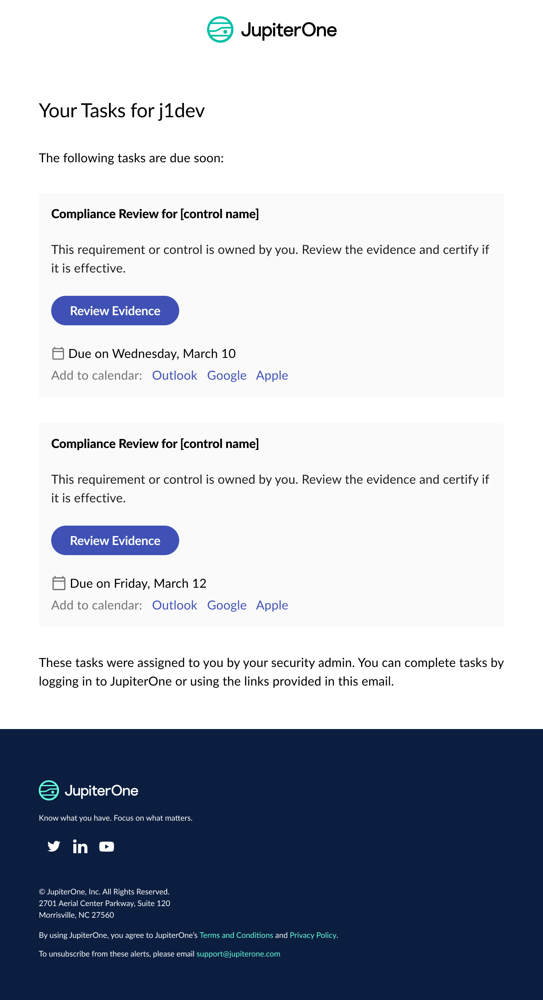

# JupiterOne 1 December 2022 Release

## New Features and Improvements
- New managed dashboards in J1 Insights give you premade visualizations based on your most critical use cases. 
- Save your J1Insights dashboards under the new favorites categories to organize your Insights and enhance your navigation experience.
- J1 Insights widget downloads now support downloads of matrix, table, and status charts built with multiple queries to `.csv` files. 
- Compliance review reminder emails have a new look and feel, and include the ability to set calendar reminders. 

## Integrations
### General
  - On the Instance Configuration page for each integration, when the polling interval is set to daily, you can now select an optional hour of the day. The integration runs at the specified hour.  For example, if the hour is set to 8:00, the integration runs between 8:00 and 9:00.
  - On the Instance Configuration page for each integration, when the polling interval is set to weekly, you can now select an optional day of the week and hour of the day. The integration then runs on a specific day or on a specific day at a specific time.
  - Fixed an issue the where CMD+delete did not clear the search value on the integrations page.
  - Improved the load times on the page that lists all of the configurations for a specific integration.  Instead of calculating the number of entities when the page is loaded, you can request the number of entities to be calculated, as needed.  There is also a link that executes a J1QL to display more details about the count for each entity that the integration is ingesting.

### AWS
  - Redshift Serverless ingestion is now supported.

### Jenkins
  - Released a new integration for [Jenkins][https://github.com/JupiterOne/graph-jenkins/blob/main/docs/jupiterone.md].
  - The following entities are created:

    | Resources  | Entity `_type`       | Entity `_class` |
    | ---------- | -------------------- | --------------- |
    | Account    | `jenkins_account`    | `Account`       |
    | Job        | `jenkins_job`        | `Project`       |
    | Repository | `jenkins_repository` | `Repository`    |
    | User       | `jenkins_user`       | `User`          |

  - The following relationships are created:

    | Source Entity `_type` | Relationship `_class` | Target Entity `_type` |
    | --------------------- | --------------------- | --------------------- |
    | `jenkins_account`     | **HAS**               | `jenkins_job`         |
    | `jenkins_account`     | **HAS**               | `jenkins_user`        |
    | `jenkins_job`         | **HAS**               | `jenkins_job`         |
    | `jenkins_job`         | **HAS**               | `jenkins_repository`  |

### Okta
  - Added `countryCode` as a property on the `okta_user` entity.

### Trend Micro Deep Security
  - The following properties were added to the `trend_micro_computer` entity: `awsAccountId`, `cloudProvider`, and `ec2InstanceId`
  - The integration now attempts to create a relationship between `trend_micro_computer` and `aws_instance`.

### VMware vSphere
  - Fixed the DockerHub image so that it includes all required dependencies.

## Bug Fixes
- Fixed an issue where some AWS accounts were being uploaded without their associated tags.
- Resolved an issue in Search Anywhere for tags and owners to be bulk added. 
- Expanded the detailed properties side panel overlay to resolve a bug in Jj1 Compliance and Alerts. 
- Resolved a few issues related to Alert Rules configuration. 

## Coming Soon

- Your J1 Insights dashboard will soon be downloadable as a PDF to help facilitate the sharing of your dashboards offline. 
- Your query permissions will be extended to J1 Insights to ensure your groups are only seeing what their permissions grant them. 
- Upcoming releases for in-app notifications will keep you informed on the latest notifications from J1 Rapid Response, Policies, Compliance, and Integrations. 
- No more silent failures for your alert rules: get notified when rules are not working, including an error log to help you triage and manage.
- In the coming months, we will be updating the Questions Library, Homepage, and KPIs to make finding the right information and questions even easier.
- If you are a Google BigQuery user, you will soon be able leverage your J1 data bi-directionally to trigger and route alerts right from your J1 account to your internal BigQuery instances.
- AWS Config Recorder will soon be a fully supported and generally available service to all J1 users via the J1 Integrations section of the platform.
