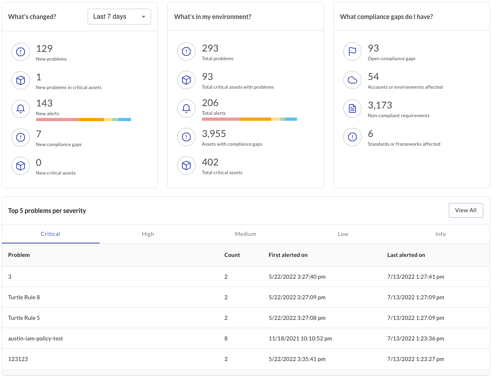
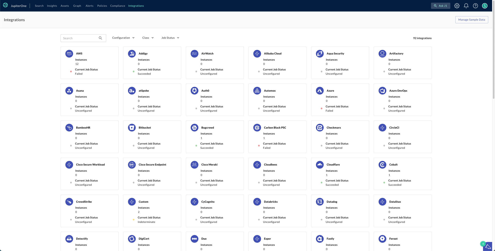

# JupiterOne 14 July 2022 Release

## New Features and Improvements
- Address top problems from the homepage: You can now see and take action on the top alerts that are revelant to your security to-do list. The top problems widget allows you to access alerts directly from the J1 Search homepage, sorted by criticality. 
 

- Integrations has a new look-and-feel: Integrations page is visually updated to offer a refreshed experience, aligning with the rest of JupiterOne UI updates. 

- Introducing: The new JupiterOne navigation bar. The navigation bar is updated to pull out key actions from the previous tile menu and the settings menu. You can now access the Graph and Integrations directly from the navigation bar.
- For the audit trail in Policies, the email address of the user related to a set of changes is now included in the file download. 
- The Mac keyboard shortcut for Search Anywhere `CMD + K` is now supported. 

## Integrations
### AWS

- Added the following entities:
| Resources                 | Entity `_type`              | Entity `_class` |
| ------------------------- | --------------------------- | --------------- |
| AWS CodePipeline Pipeline | `aws_codepipeline_pipeline` | `Workflow`      |
| AWS CodePipeline Service  | `aws_codepipeline`          | `Service`       |

- Added the following relationships:
| Source Entity `_type`               | Relationship `_class` | Target Entity `_type`       |
| ----------------------------------- | --------------------- | --------------------------- |
| `aws_codepipeline`                  | **HAS**               | `aws_codepipeline_pipeline` |

- When more than 50 Instances are managed by SSM in a region, the step was failing due to API limits. This is now fixed.
- J1 now stops building `aws_network_acl_protects_subnet` if `networkAcl.SubnetId` is undefined.

### Cisco Secure Workload

- Fixed an issue that was preventing workloads with a null uuid from being ingested.
- Fixed an issue that we causing the same workload finding relationship to be created multiple times.

### Datastax Astra

- Released a new integration for [Datastax](https://www.datastax.com/)
- The following entities are created:
| Resources           | Entity `_type`                 | Entity `_class` |
| ------------------- | ------------------------------ | --------------- |
| Access List         | `datastax_access_list`         | `Firewall`      |
| Access List Address | `datastax_access_list_address` | `Configuration` |
| Access Role         | `datastax_access_role`         | `AccessRole`    |
| Database            | `datastax_database`            | `Database`      |
| Organization        | `datastax_organization`        | `Organization`  |
| User                | `datastax_user`                | `User`          |

- The following relationships are created:
| Source Entity `_type`   | Relationship `_class` | Target Entity `_type`          |
| ----------------------- | --------------------- | ------------------------------ |
| `datastax_access_list`  | **HAS**               | `datastax_access_list_address` |
| `datastax_database`     | **ASSIGNED**          | `datastax_access_list`         |
| `datastax_organization` | **HAS**               | `datastax_access_list`         |
| `datastax_organization` | **HAS**               | `datastax_database`            |
| `datastax_organization` | **HAS**               | `datastax_database`            |
| `datastax_organization` | **HAS**               | `datastax_user`                |
| `datastax_user`         | **ASSIGNED**          | `datastax_access_role`         |

### Microsoft 365

- Integration no longer sets `jailBroken` to true when response from API is "jailBroken": "Unknown". It is now set to `undefined`.

### Microsoft Teams

- Released a new integration for [Microsoft Teams](https://www.microsoft.com/en-us/microsoft-teams/group-chat-software).
- The following entities are created:
| Resources | Entity `_type`            | Entity `_class` |
| --------- | ------------------------- | --------------- |
| Account   | `microsoft_teams_account` | `Account`       |
| Channel   | `microsoft_teams_channel` | `Channel`       |
| Team      | `microsoft_teams_team`    | `Group`         |
| User      | `microsoft_teams_user`    | `User`          |

- The following relationships are created:
| Source Entity `_type`     | Relationship `_class` | Target Entity `_type`     |
| ------------------------- | --------------------- | ------------------------- |
| `microsoft_teams_account` | **HAS**               | `microsoft_teams_team`    |
| `microsoft_teams_account` | **HAS**               | `microsoft_teams_user`    |
| `microsoft_teams_team`    | **HAS**               | `microsoft_teams_channel` |
| `microsoft_teams_team`    | **HAS**               | `microsoft_teams_user`    |

## Bug Fixes
- Resolved an issue where Insight tables were limiting the returns to 50 rows, regardless of the amount of data available in the table. 
- Fixed a bug related to the last sign-in timestamp on the J1 homepage, where dates were not transcribed properly. 
- Addressed a problem in J1 Compliance with linking policies to requirements where data did not persist when unlinking and relinking items. 
- Fixed an issue with RBAC privileges for J1 Compliance non-admins. 
- Resolved a bug where querying for `getprocedure` returned duplicates, regardless of the policy. 

## Coming Soon
In the coming weeks, look for the following new features and enhacements:
- Updates to the entity drawer in J1 Assets, including an updated look-and-feel and additional actions. 
- Additional updates to the J1 Search homepage to help you find the information that matters to you, faster.
- Insights is getting a refresh: this includes an updated look-and-feel, aligning with JupiterOne's visual updates, and will also introduce updated functionality.
- Job statuses for J1 Integrations: know more about your integration jobs in a single consolidated view so you can see what you need to address and feel confident in the data JupiterOne receives. 
- The `IAM` query policy is getting some updates to expand on the ability to use scoped `IAM` policies. 
