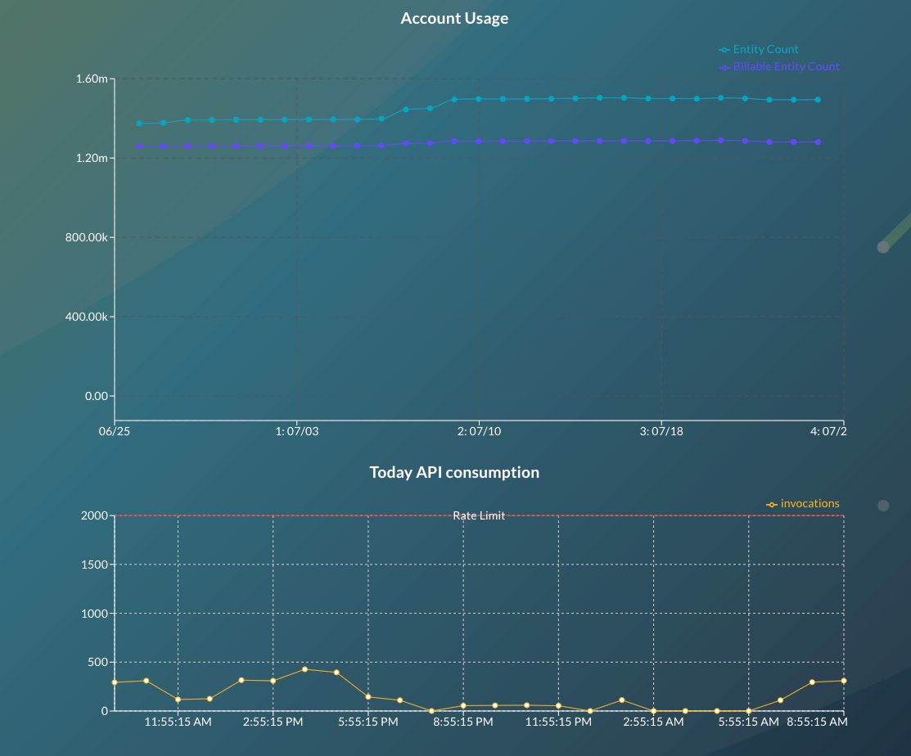

# JupiterOne 28 July 2022 Release

## New Features and Improvements
-  The J1 graph engine is updated, providing faster processing and updates to the look-and-feel of the graph.
-  You can now open an asset in its own page, which allows you to see information about that asset in one single location. You access this page in the entity drawer in J1 Assets. 
-  Understand your API consumption for your account: Managing your account just became easier, as J1 has added methods to monitor your account usage of our rate-limited APIs. 
   

 

## Integrations

### AWS
- The following new entities are created:

    | Service                  | Entity `_type`            | Entity `_class` |
    | ------------------------ | ------------------------- | --------------- |
    | SSM (Service Manager)    | `aws_instance_inventory`  |                 |
    | AWS CodeCommit Service   | `aws_codecommit`          | `Service`       |
    | AWS Inspector v2 Service | `aws_inspectorv2`         | `Service`       |

- The following new relationships are created:

    | Source Entity `_type`               | Relationship `_class` | Target Entity `_type`               |
    | ----------------------------------- | --------------------- | ----------------------------------- |
    | `aws_instance`                      | **HAS**               | `aws_instance_inventory`            |
    | `aws_elasticache_cluster_node`      | **HAS**               | `aws_security_group`                |
    | `aws_elasticache_memcached_cluster` | **HAS**               | `aws_security_group`                |
    | `aws_elasticsearch_domain`          | **HAS**               | `aws_security_group`                |
    | `aws_inspectorv2`                   | **SCANS**             | `aws_instance`                      |
    | `aws_security_group`                | **PROTECTS**          | `aws_elasticache_cluster_node`      |
    | `aws_security_group`                | **PROTECTS**          | `aws_elasticache_memcached_cluster` |
    | `aws_security_group`                | **PROTECTS**          | `aws_elasticsearch_domain`          |
    | `aws_subnet`                        | **HAS**               | `aws_elasticsearch_domain`          |

### BambooHR
- `bamboohr_user` now includes the `lastLogin` property.

### GitHub
- Added a field that allows you to specify a start date when ingesting historical pull requests.
- On the `githuh_finding` entity, the `Summary` property name is changed to `description`.

### Google Cloud
- Added support for additional Google Cloud compute regions.
- Improvements to reduce the number of API calls needed during ingestion.

### Google Workspace
- The integration was renamed from Google to Google Workspace.

### Microsoft 365
- If API response for `jailBroken` is `unknown`, JupiterOne sets the property value to `undefined` instead of `true`

### Orca
- New properties added to entities:

    | Entity         | Properties              |
    | -------------- | ----------------------- |
    | `orca_finding` | `groupType`             |
    | `orca_finding` | `clusterType`           |
    | `orca_finding` | `type`                  |
    | `orca_finding` | `assetCategory`         |
    | `orca_finding` | `assetType`             |
    | `orca_finding` | `cloudVendorId`         |
    | `orca_finding` | `assetDistributionName` |
    | `orca_finding` | `cloudProvider`         |
    | `orca_asset`   | `enabled`               |
    | `orca_asset`   | `type`                  |
    | `orca_asset`   | `state`                 |
    | `orca_asset`   | `groupType`             |
    | `orca_asset`   | `clusterType`           |
    | `orca_asset`   | `category`              |
    | `orca_asset`   | `cloudVendorId`         |
    | `orca_asset`   | `cloudProvider`         |
    | `orca_asset`   | `cloudProviderId`       |
    | `orca_asset`   | `level`                 |
    | `orca_asset`   | `clusterUniqueId`       |
    | `orca_asset`   | `clusterName`           |
    | `orca_asset`   | `organizationId`        |
    | `orca_asset`   | `accountName`           |

- Fixed an issue that was preventing the import of all assets from Orca accounts with more than 10000 assets.

### SimpleMDM
- Released a new integration for SimpleMDM.
- In this initial release, only the following entities and relationships are created. The integration does not create mapped relationships to other integrations.

- The following entities are created:

  | Resources   | Entity `_type`          | Entity `_class` |
  | ----------- | ----------------------- | --------------- |
  | Account     | `simplemdm_account`     | `Account`       |
  | Application | `simplemdm_application` | `Application`   |
  | Device      | `simplemdm_device`      | `Device`        |
  | User        | `simplemdm_user`        | `User`          |

- The following relationships are created:

  | Source Entity `_type` | Relationship `_class` | Target Entity `_type`   |
  | --------------------- | --------------------- | ----------------------- |
  | `simplemdm_account`   | **HAS**               | `simplemdm_application` |
  | `simplemdm_account`   | **HAS**               | `simplemdm_device`      |
  | `simplemdm_device`    | **HAS**               | `simplemdm_user`        |
  | `simplemdm_device`    | **INSTALLED**         | `simplemdm_application` |

  

### Wazuh
- Updated the integration to support the new Wazuh authentication method.

### Zendesk
- Fixed a pagination issue that was causing all data to not be imported in some cases.

## Bug Fixes
-  Fixed a few issues related to loading issues with the J1 Integrations page. 
-  Resolved an issue with the table sizing in Query Anywhere. 
-  Addressed a bug with clearing filters in J1 Assets.
-  Resolved an issue that was returning incorrect results when two or more expressions were in a `RETURN` clause.
-  Resolved an issue that was disallowing expressions to be used with scalar functions, such as `RETURN COUNT`, such as `(d.weight) * 2)`.
-  Resolved an issue that was rendering values that had a value of `false` as `NULL` in CSV exports.
-  Resolved an issue that was returning incorrect results when directional expressions were used with optional clauses, such as `(THAT HAS >> AS rel google_cloud_folder)?`.
-  Resolved an issue that was not performing the reversal of comparison operators correctly. 

## Coming Soon

In the coming weeks, look for the following new features and enhancements:

- J1 Insights is getting a refresh, including an updated look-and-feel, aligning with JupiterOne's visual updates, and will also introduce updated functionality.
- Job statuses for J1 Integrations: know more about your integration jobs in a single consolidated view so you can see what you need to address and feel confident in the data JupiterOne receives.
- The J1 graph engine is going to be updated to provide faster processing. Additionally, the overall look-and-feel of the graph will be enhanced. Look for continual updates to the graph over the coming months!  

