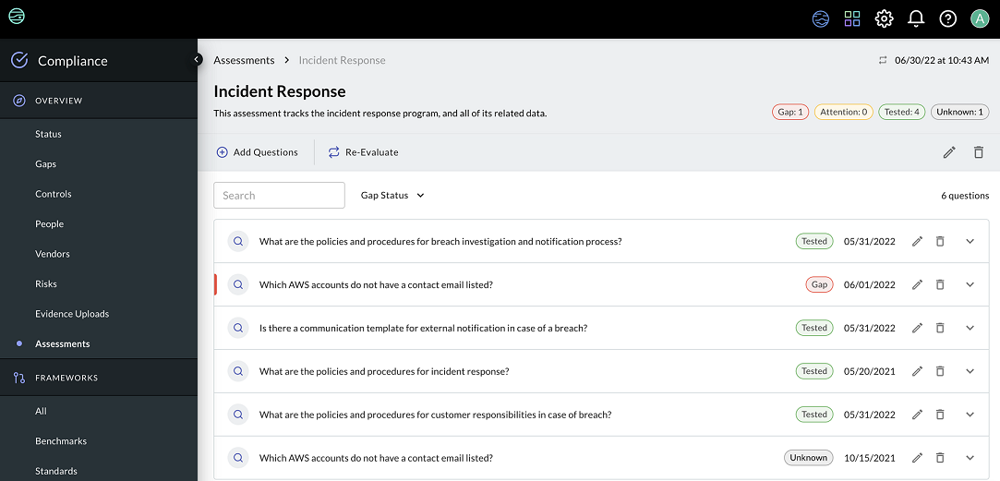

# JupiterOne 30 June 2022 Release

## New Features and Improvements
-  Introducing: Assessments! Assessments provide an easy way to understand what is in your environment, based on predefined J1QL questions. Assessments groups together as many questions as you choose and automatically runs them, so that you can evaluate your data in a signle view. This gives you a quick method to get a greater understand of what needs your attention in your environment. Users can run Assessments based on a category such as "incident response" or "privacy", based on a tag such as "CrowdStrike" or "encryption", or use keyword searching to add any question saved in the questions library. Assessments are available to everyone with J1 Compliance access.
   ​

    

   ​

-  Scope filters in J1 Compliance now support tag values, giving you the ability to easily scope a framework or benchmark to a specific tag. 

-  Additional filtering options are now available in the J1 Compliance "add question" modal when adding evidence to a framework requirement. You are able to filter based on question categories and tags, as well as show managed questions and the details of the query for a question. 

-  Organizational values for J1 Policies are now synced to account parameters, enabling you to use your defined parameters from the parameter service such as secret values in J1 Policies. Alternatively, this feature allows you to reference platform-wide variables, versus those scoped specifically to J1 Policies. 

## Integrations

### AWS
- Added the following entities:

  | Resource            | Type                 | Class                     |
  | ------------------- | -------------------- | ------------------------- |
  | AWS Kinesis Service | `aws_kinesis`        | `Service`                 |
  | AWS Kinesis Stream  | `aws_kinesis_stream` | `DataCollection`, `Queue` |

- Add the following relationships:

  | Source             | Class | Target             |
  | ------------------ | ----- | ------------------ |
  | aws_kinesis        | HAS   | aws_kinesis_stream |
  | aws_kinesis_stream | USES  | aws_kms_key        |

- Added the following mapped relationships:

  | Source Entity `_type` | Relationship `_class` | Target Entity `_type`    | Direction |
  | --------------------- | --------------------- | ------------------------ | --------- |
  | `aws_kinesis_stream`  | **USES**              | `*aws_kinesis_consumer*` | REVERSE   |

### Cisco Secure Workload
The following entities are created:

| Resources              | Entity `_type`         | Entity `_class` |
| ---------------------- | ---------------------- | --------------- |
| Account                | `csw_account`          | `Account`       |
| Interface              | `csw_interface`        | `Application`   |
| Package                | `csw_package`          | `CodeModule`    |
| Role                   | `csw_role`             | `AccessRole`    |
| Scope                  | `csw_scope`            | `Group`         |
| User                   | `csw_user`             | `User`          |
| Workload               | `csw_project`          | `Project`       |
| Workload Vulnerability | `csw_workload_finding` | `Finding`       |

The following relationships are created:

| Source Entity `_type` | Relationship `_class` | Target Entity `_type`  |
| --------------------- | --------------------- | ---------------------- |
| `csw_account`         | **HAS**               | `csw_role`             |
| `csw_account`         | **HAS**               | `csw_user`             |
| `csw_interface`       | **HAS**               | `csw_scope`            |
| `csw_package`         | **HAS**               | `csw_workload_finding` |
| `csw_project`         | **HAS**               | `csw_interface`        |
| `csw_project`         | **HAS**               | `csw_package`          |
| `csw_project`         | **HAS**               | `csw_workload_finding` |
| `csw_role`            | **USES**              | `csw_scope`            |
| `csw_scope`           | **HAS**               | `csw_scope`            |
| `csw_user`            | **ASSIGNED**          | `csw_scope`            |
| `csw_user`            | **HAS**               | `csw_role`             |

### CrowdStrike
- Fixed an issue so that the `crowdstrike_sensor` maps to `aws_instance` entities when the CrowdStrike device's `service_provider` property has the value `AWS_EC2_V2`.

### GitHub
- `Finding` relationships to `CWE` and `CVE` are now mapped relationships and do not create direct relationships.
- Fixed an issue that was causing duplicate pull request entities to be created.

### Jamf
- Changed the `extensionAttributes` properties of `user_endpoint` entity to only include the Deployment status property due to entity size concerns.

### Microsoft 365
- `macAddress`, `ipAddress`, `hostname`, and `ethernetMacAddress` properties are added to managed device entities (`Host`, `Device`).
- `macAddress` properties on managed devices are normalized to a `aa:bb:cc:11:22:33` format.

### Orca
- Changed this relationship:

  | Source         | class          | Target |
  | -------------- | -------------- | ------ |
  | `orca_finding` | ~~HAS~~ **IS** | `cve`  |

### Qualys
- Added a configuration setting for `webAppScanApplicationIdFilter` to limit ingestion of web apps that match IDs provided in the filter.

### Slack
- Improved error messaging when account validation issues are encountered.

## Bug Fixes
- Fixed multiple bugs related to Search and Search history performance. 
- Resolved an issue with limits on custom questions in Search.
- Addressed a problem with the Compliance control library where updates were not reflected without a refresh.

## Coming Soon
- In the coming weeks, we will be introducing a new navigation pattern. We are retiring the tile pattern for navigating between areas of the platform, and pulling out each application into the top-level navigation bar. 
- The Asset details drawer is getting some updates! Stay tuned for more information. 

