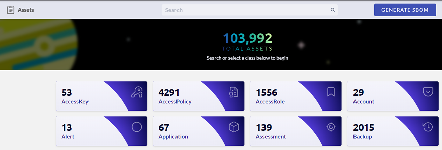
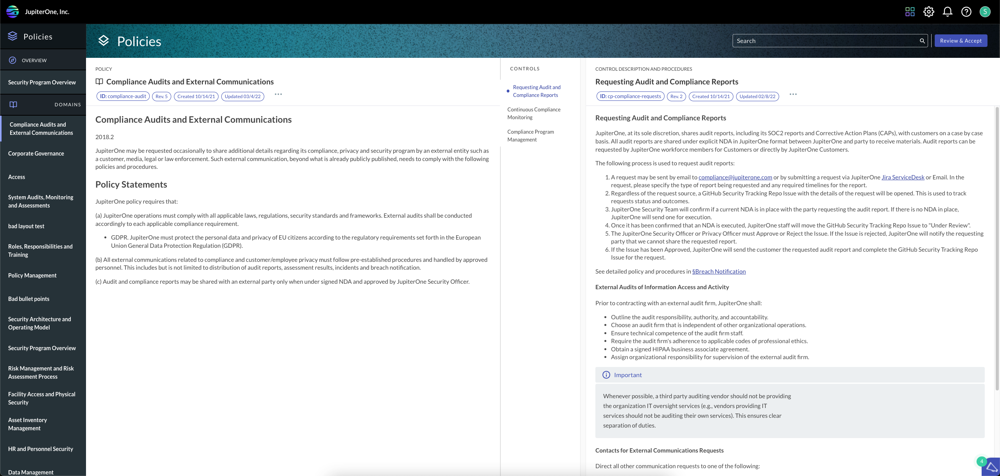

# JupiterOne 14 March 2022 Release

## March 14, 2022

## New Features and Improvements
- In J1 Assets, SBOM (software bill of materials) files in JSON format are now generated when specific criteria is met.

- Policies has a new look-and-feel.

- The formula for how J1 calculates the frameworks compliance percentage is now a tooltip within the Compliance app.
- You can now query for the following metadata integration properties:
  - `_integrationDefinitionId`
  - `_integrationInstanceid`

## Integrations

### Azure
Fixed an issue related to subnet and virtual machine relationships that was causing a duplicate key error.

### Datadog
Released a new integration for [Datadog](https://www.datadog.com).

Created the following entities:

| Entity `_type`    | Resources | Entity `_class` |
| ----------------- | --------- | --------------- |
| `datadog_account` | Account   | `User`          |
| `datadog_role`    | Role      | `AccessRole`    |
| `datadog_user`    | User      | `User`          |

Created the following relationships:

| Source Entity_type | Relationship _class | Target Entity _type |
| ------------------ | ------------------- | ------------------- |
| `datadog_account`  | **HAS**             | `datadog_role`      |
| `datadog_role`     | **HAS**             | `datadog_user`      |
| `datadog_user`     | **ASSIGNED**        | `datadog_role`      |

### GitHub

Added support for GitHub Enterprise Server. There is a new option in the configuration that allows you to specify the hostname and other parameters for an Enterprise Server instance.

### Google Cloud (GCP)
- J1 now ingests Kubernetes clusters and their node pools labels/tags. The  `google_container_cluster` now has the following new properties:

  | Property               | Type     |
  | ---------------------- | -------- |
  | `metadata.description` | `string` |
  | `metadata.labels.*`    | `string` |
- The `google_container_node_pool` now has the following new properties:

  | Property               | Type       |
  | ---------------------- | ---------- |
  | `metadata.gce.*`       | `string`   |
  | `metadata.labels.*`    | `string`   |
  | `metadata.networkTags` | `string[]` |
### Qualys
- Added new properties to resources:
  | Entity                   | Properties                            |
  | ------------------------ | ------------------------------------- |
  | `qualys_host_finding`    | `qualysSeverity`                      |
  | `qualys_web_app_finding` | `qualysSeverity`                      |
  | `qualys_host_finding`    | `awsAccountId`                        |
  | `qualys_host_finding`    | `gcpProjectId`, `gcpInstanceSelfLink` |
- J1 now ingests GCP data from host detection to support new relationships:
  | Source Entity                  | Relationship                        | Target Entity            |
  | ------------------------------ | ----------------------------------- | ------------------------ |
  | `qualys_vulnerability_manager` | `SCANS`     google_compute_instance |                          |
  | `qualys_host_finding`          | `HAS`                               | google_compute_instance` |
- The `cveList` property has changed to `cveIds` and a bug causing `CVEList` to serialize to `[Object object]` has been fixed using the new function `cveListToCveIds`
### Rumble
- Released a new integration for [Rumble](https://www.rumble.run).

- Created the following entities:

  | Resources    | Entity `_type`        | Entity `_class` |
  | ------------ | --------------------- | --------------- |
  | Account      | `rumble_account`      | `Account`       |
  | Asset        | `rumble_asset`        | `Device`        |
  | Organization | `rumble_organization` | `Organization`  |
  | Site         | `rumble_site`         | `Site`          |
  | User         | `rumble_user`         | `User`          |
- Created the following relationships:
  | Source Entity `_type` | Relationship `_class` | Target Entity `_type` |
  | --------------------- | --------------------- | --------------------- |
  | `rumble_account`      | **HAS**               | `rumble_organization` |
  | `rumble_account`      | **HAS**               | `rumble_user`         |
  | `rumble_organization` | **HAS**               | `rumble_site`         |
  | `rumble_site`         | **HAS**               | `rumble_asset`        |
  | `rumble_user`         | **ASSIGNED**          | `rumble_organization` |
### Snyk
Fixed an issue that was causing an incorrect mapping of `_type` and `_class` properties for the `CVEEntity`.

### Tenable.io
Added exploit-related properties to the `Vulnerability` entity.

### Terraform Cloud
- Released a new integration for Terraform Cloud.

- Created the following entities:

  | Resources       | Entity `_type`           | Entity `_class` |
  | --------------- | ------------------------ | --------------- |
  | Account         | `tfe_account`            | `Account`       |
  | Entitlement Set | `tfe_entitlement_set`    | `Entity`        |
  | Organization    | `tfe_organization`       | `Organization`  |
  | Resource        | `tfe_workspace_resource` | `Resource`      |
  | Team            | `tfe_team`               | `Team`          |
  | User            | `tfe_user`               | `User`          |
  | Workspace       | `tfe_workspace`          | `Project`       |
- Created the following relationships:

  | Source Entity `_type` | Relationship `_class` | Target Entity `_type`    |
  | --------------------- | --------------------- | ------------------------ |
  | `tfe_account`         | **HAS**               | `tfe_organization`       |
  | `tfe_organization`    | **HAS**               | `tfe_entitlement_set`    |
  | `tfe_organization`    | **HAS**               | `tfe_team`               |
  | `tfe_organization`    | **HAS**               | `tfe_user`               |
  | `tfe_organization`    | **HAS**               | `tfe_workspace`          |
  | `tfe_organization`    | **HAS**               | `tfe_workspace_resource` |
### Zendesk
- Released a new integration for [Zendesk](https://www.zendesk.com).

- Created the following entities:

  | Resources    | Entity `_type`         | Entity `_class` |
  | ------------ | ---------------------- | --------------- |
  | Account      | `zendesk_account`      | `Account`       |
  | Group        | `zendesk_group`        | `Group`         |
  | Organization | `zendesk_organization` | `Organization`  |
  | Ticket       | `zendesk_ticket`       | `Record`        |
  | User         | `zendesk_user`         | `User`          |

- Created the following relationships:
  | Source Entity `_type`  | Relationship `_class` | Target Entity `_type`  |
  | ---------------------- | --------------------- | ---------------------- |
  | `zendesk_account`      | **HAS**               | `zendesk_organization` |
  | `zendesk_group`        | **HAS**               | `zendesk_ticket`       |
  | `zendesk_group`        | **HAS**               | `zendesk_user`         |
  | `zendesk_organization` | **HAS**               | `zendesk_group`        |
  | `zendesk_user`         | **ASSIGNED**          | `zendesk_ticket`       |
  | `zendesk_user`         | **OPENED**            | `zendesk_ticket`       |

## Bug Fixes

-  Resolved bugs related to using the Load All button for the Graph Viewer.
-  Resolved several issues with PDF downloads in the Policies app.
-  Fixed a bug in Insights where the bar chart widgets did not order correctly.
-  Resolved an issue where multiple questions linked as evidence for a requirement could not been seen due to the background color in the Compliance app.
-  Resolved issues related to framework evaluation and evidence downloads in the Compliance app. 
-  Resolved a bug so that the CLI tool for provisioning alert rule packs is now working correctly.

