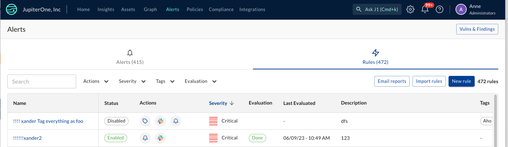

## New Features and Improvements
- We have made it easier to view and update the Rules that power your alerts within the Alerts UI by surfacing Rules to sit alongside Alerts in the views primary actions.
  
-
-

## Integrations
- Workday: We have added Workday to our list of official integrations. [Read more about our Workday integration](https://docs.jupiterone.io/integrations/directory/workday).
- Custom File Transfer: Added new integration `Custom File Transfer` to enable users to create more robust file transfer jobs that can be scheduled, with all of the flexibility and auditability of normal integrations
- Azure: Allow the ingestion of 'Disabled' subscriptions in addition to the other subscription states supported: ‘Enabled’, ‘PastDue’, ’Warned’ and ’Expired’. You can enable the importation of 'Disabled' subscription by activating the **Import Disabled Subscriptions** toggle within your Azure integration instance. Note that your Azure integration instance must already have the **Configure Subscription Instances** toggle enabled for you to ingest disabled subscriptions.
- ServiceNOW: Added the capability to ingest a customizable level of **ServiceNOW CMDB** data.  Includes relationships showing *to whom assets are assigned* and *who owns/manages the assets*
- Microsoft Intune: Added properties `lastSyncDateTime` and `enrolledDateTime`
- CrowdStrike: Added CrowdStrike **Zero Trust Assessment (ZTA)** data to be ingested
- Google Cloud Platform: Added a relationship from the `Root` entity to the GCP Organization entity
- Google Cloud Platform: Consume guest VM properties via OS Config API, including Hostname, OS Name, OS Version, Kernel Version, OS Architecture, Agent Version and Last Updated Time
- GitLab: Will now consume **GitLab Vulnerability Findings**
- SalesForce: Added the ability to filter ingested users by user **Role** and **Profile** to avoid rate limits and improve performance
- Polymer: Added mapped relationships from Polymer findings to Google Workspace, Slack and GitHub to indicate ownership of findings and other additional context. **Note**: This integration is currently in beta
- Tanium: Added ingestion of Software Inventory data from "Tanium Asset" add-on capability
- AWS: AWS integrations will now be automatically deleted when the related AWS account is closed
- AWS: Added a mapped relationship for Person or Teams entity that OWNs an aws_account
- AWS: Added a mapped relationship between Crowdstrike HostAgents and AWS Workspace Hosts

Bug Fixes:

- GoDaddy: Resolved issue which was causing a `429` error (too many requests)
- SonarQube: Update query approach to reduce issues with hitting API return limitations
- CircleCI: Resolved issue where duplicate piplines were being ingested, causing the integration job to fail
- Tanium: Updates to match recent changes to Tanium API
- AWS: Resolved issue causing `404` error if alternate contact not found

