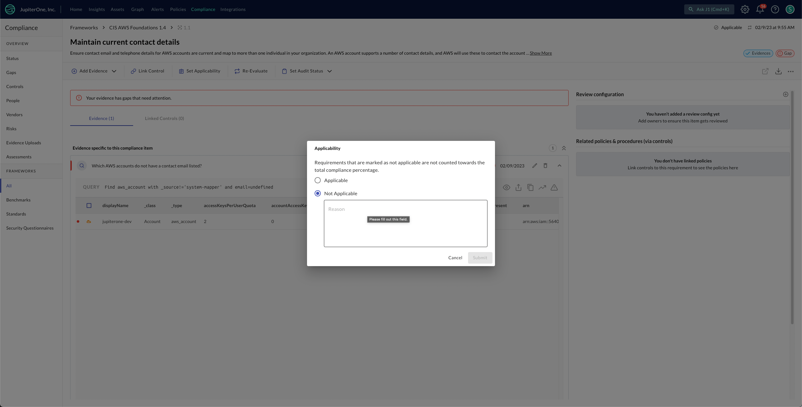
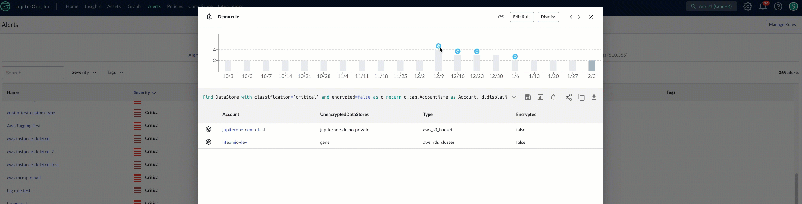

# JupiterOne 2 March 2023 Release

## New Features and Improvements
-  Your J1 Insights dashboards are now equipped with pagination in the `data-table`. This change makes your dashboards load quicker and provides a uniform `data-table` experience throughout J1. 
-  The expandable properties panel with the preset graph views is now available when inspecting entities in the graph canvas. 
- All your `csv` exports links are now sent to the notification panel, which will allow you to move throughout your J1 workflows and get notified when your `csv` is ready to be download.
  
  
  

 

- In J1 Compliance, you can now set compliance requirement applicability at the top level, giving you greater control over your compliance posture for your unique security needs. For requirements marked as `not applicable`, you can now provide the business justification with J1, saving time and providing clarity.

  

  

   

- The alert trend in your Alerts modal is updated to provide detailed information on the status of the rule that powers the alert outcome. The trend shows when an alert was triggered, the result count, as well as when a rule failed to evaluate. 
  
  
  

## New Integrations

#### **AWS CodeBuild**

  - Added the AWS CodeBuild integration with the following entities:

    | Source                              | `_type`                                   | Entity `class`    |
    | ----------------------------------- | ----------------------------------------- | ----------------- |
    | AWS CodeBuild Service               | `aws_codebuild`                           | `Service`         |
    | CodeBuild Project	                  | `aws_codebuild_project`                   | `CodeRepo`        |
    | CodeBuild Report Group	          | `aws_codebuild_report_group`              |	`Resource`        |

#### **AWS Inspector**

  - Added the AWS Inspector V2 integration with the following entities:

    | Source                              | `_type`                                   | Entity `class`    |
    | ----------------------------------- | ----------------------------------------- | ----------------- |
    | AWS Inspector v2 Service            | `aws_inspectorv2`                         | `Service`         |
    | Inspector v2 Finding                | `aws_inspectorv2_finding`                 | `Finding`         |

#### **AWS Network Firewall Service**

  - Added support for AWS Network Firewall Service with the following entities:

    | Source                              | `_type`                                   | Entity `class`    |
    | ----------------------------------- | ----------------------------------------- | ----------------- |
    | AWS Network Firewall Service        | `aws_networkfirewall`                     | `Service`         |

#### **AWS Shield Advance**

  - Added support for additional entities for the AWS Shield Advance integration:

    | Source                              | `_type`                                   | Entity `class`    |
    | ----------------------------------- | ----------------------------------------- | ----------------- |
    | AWS Shield Protection	              | `aws_shield_protection`                   |	`Firewall`        |
    | AWS Shield Protection Group	      | `aws_shield_protection_group`	          | `ResourceGroup`   |
    | AWS Shield Service	              | `aws_shield`                              |	`Service`         |
    | AWS Shield Subscription	          | `aws_shield_subscription`  	              | `Subscription`    |

#### **AWS Kinesis Data Stream**

  - Added the AWS Kinesis Data Stream integration with the following entities:

    | Source                              | `_type`                                   | Entity `class`    |
    | ----------------------------------- | ----------------------------------------- | ----------------- |
    | AWS Kinesis Service                 | `aws_kinesis`                             | `Service`         |
    | AWS Kinesis Stream                  | `aws_kinesis_stream`                      | `Data Collection`, `Queue` |

#### **AWS Lex**

  - AWS Lex now supports the following entities:

    | Source                              | `_type`                                   | Entity `class`    |
    | ----------------------------------- | ----------------------------------------- | ----------------- |
    | AWS Lex V2 Bot                      | `aws_lexv2_bot`                           | `Model`           |
    | AWS Lex V2 Bot Alias                | `aws_lexv2_bot_alias`                     | `Model`           |
    | AWS Lex V2 Service                  | `aws_lexv2`                               | `Service`         |        

#### **AWS Secrets Manager Service**

  - Added support for the AWS Secrets Manager Service entity:

    | Source                              | `_type`                                   | Entity `class`    |
    | ----------------------------------- | ----------------------------------------- | ----------------- |
    | AWS Secrets Manager Service         | `aws_secretsmanager`                      | `Service`         |

#### **AWS Config Recorder: AccessAnalyzer, AC, API Gateway, AutoScaling, and ELB, and ELBV2**

  - Added services to AWS Config Recorder integration with the following entities:

    | Source                              | `_type`                                   | Entity `class`    |
    | ----------------------------------- | ----------------------------------------- | ----------------- |
    | Configservice Rule                  | `aws_config_rule`                         | `ControlPolicy`   |
    | Configservice Service               | `aws_config`                              | `Service`         |
    | AWS AccessAnalyzer Service	      | `aws_accessanalyzer`                      |	`Service`         |
    | AccessAnalyzer Analyzer	          | `aws_accessanalyzer_analyzer`             | `Assessment`,`Scanner`|
    | AccessAnalyzer Finding	          | `aws_accessanalyzer_finding`              | `Finding`         |
    | AWS ACM Service                     | `aws_acm`                                 | `Service`         |
    | AWS Autoscaling Service             |	`aws_autoscaling`                         |	`Service`         |
    | Autoscaling Group	                  | `aws_autoscaling_group`              	  | `Deployment`, `Group` |
    | Autoscaling Launch Configuration	  | `aws_autoscaling_launch_configuration     | `Configuration`   |
    | Autoscaling Policy	              | `aws_autoscaling_policy`                  |	`Configuration`   |
    | ELB Application Load Balancer	      | `aws_alb`	                              | `Gateway`         |
    | ELB Gateway Load Balancer	          | `aws_elb`	                              | `Gateway`         |
    | ELB Network Load Balancer	          | `aws_nlb`	                              | `Gateway`         |
    | AWS ApiGateway Service              | `aws_apigateway`	                      | `Service`         |

#### **Polymer**

  - Added Polymer integration with the following entities:

    | Source                              | `_type`                                   | Entity `class`    |
    | ----------------------------------- | ----------------------------------------- | ----------------- |
    | Account                             | `polymer_account`                         |	`Account`         |
    | Rule	                              | `polymer_rule`                            | `Rule`            |
    | Violation     	                  | `polymer_violation`                       | `Finding`         |

#### **XM Cyber**

  - Added XM Cyber integration with the following entities:

    | Source                              | `_type`                                   | Entity `class`    |
    | ----------------------------------- | ----------------------------------------- | ----------------- |
    | Entity                              | `xmcyber_entity`                          |	`Record`          |

## Bug Fixes

-   Deleted entities, if turned on, can be included in `csv` downloads after a recent download bug fix. 

## Coming Soon

- Introducing: Asset Categories! J1 is reworking how assets are categorized, based on industry standards. These categorizes will persist throughout J1 to make searching and finding, the right information easier. 
- The home experience will become more flexible for your user groups by allowing you as an admin to publish J1 Insights dashboards to you and your user groups landing experience.  
- AWS Config Recorder will soon be a fully supported and generally available service to all J1 users via the J1 Integrations section of the platform.
- Alert rules will soon alert on new results only, reducing duplicates from queries and cutting through the noise to highlight what is important and what needs your attention. 
- New trend chart visualizations are coming to Insights to help you and your teams answer key questions of your assets over time within the dashboarding experience. 
