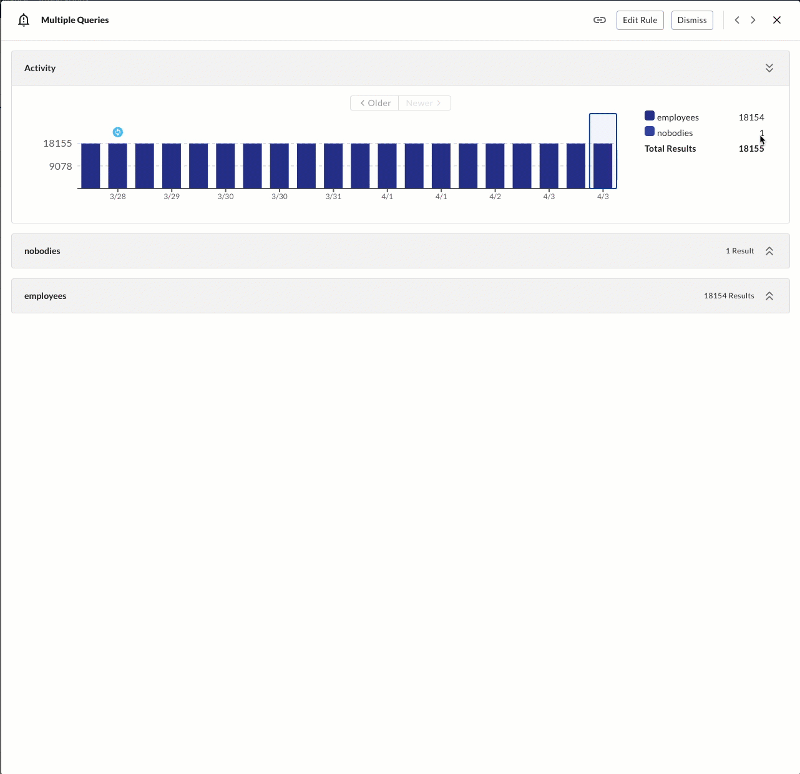
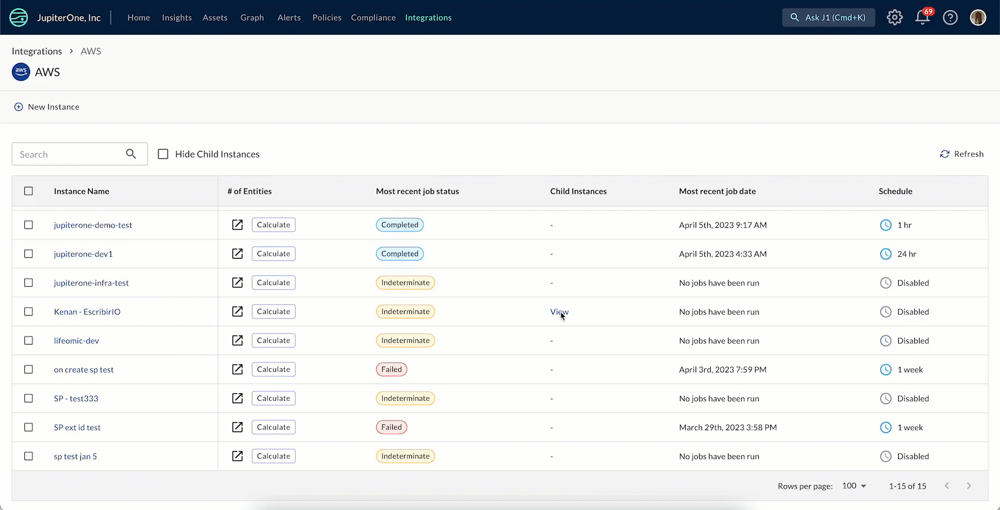

# JupiterOne 31 March 2023 Release

## New Features and Improvements
-   Your `csv` exports can now support multiple queries from Insights.
-   Alerts with multiple queries in the Rules now display all queries that power the Alert, along with additional information about when an action was triggered and the results. 

   
-   For organizations using Google as their Identity Provider, JupiterOne now pulls in the users Google profile picture into their J1 user account. 

- You can now assign users of J1 to be notified for certain Alert Rules, including yourself or others. This assigns ownership and allows you to set up Alert Rules that notify a single user (or the users assigned) when triggered, rather than everyone. 

-   Your AWS integrations now display parent-child relationships, allowing you to see the high-level view of how instances relate to each other. 

   

## Integrations
- Updated Artifactory to include the relationship for `CodeRepo USES CodeModule`.
- For AWS ElastiCache, the following change was made: `aws_elasticache_cluster_node USES aws_eni`.
### BigID
- Added a new integration for BigID. 
- The following entities are created. 
   | Resources | Entity `_type`   | Entity `_class` |
   | --------- | ---------------- | --------------- |
   | Account   | `bigid_account`  |  `Account`      |
   |Data Source|`bigid_datasource`| `DataCollection`|
   |PII Object |`bigid_pii_object`| `Record`        |
   |  User     | `bigid_user`     | `User`          |

- The following relationships are created. 
    | Source Entity `_type`     | Relationship `_class` | Target Entity `_type`     |
    | ------------------------- | --------------------- | ------------------------- |
    | `bigid_account`           | **HAS**               | `bigid_user`              |
    | `bigid_account`           | **SCANS**             | `bigid_datasource`        |
    | `bigid_datasource`        | **HAS**               | `bigid_pii_object`        |    
   
 - The follwing mapped relationships are created.
    | Source Entity `_type`     | Relationship `_class` | Target Entity `_type`     | Direction |
    | ------------------------- | --------------------- | ------------------------- |-----------|
    | `bigid_account`           | **HAS**               | *aws_s3_bucket*           | FORWARD   |
    
### Device42
- Added a new integration for Device42.
- The following entities are created. 
 | Resources | Entity `_type`    | Entity `_class` |
 | --------- | ----------------- | --------------- |
 | Account   | `device42_account`|  `Account`      |
 |Device     |`device42_device`  | `Device`        |
 |End User   |`device42_enduser` | `User`          |

- The following relationships are created:

    | Source Entity `_type`     | Relationship `_class` | Target Entity `_type`     |
    | ------------------------- | --------------------- | ------------------------- |
    | `device42_account`        | **HAS**               | `device42_device`         |
    | `device42_account`        | **HAS**               | `device42_enduser`        |

## Bug Fixes
-  Errors for `png` and `pdf` downloads in Insights have been resolved. 
-  Errors for `csv` downloads have been resolved. 
-  Issues with downloading evidence for specific requirements in Compliance have been fixed. 
-  A problem with the Alert Modal indifinately loading due to query size has been resolved. 

## Coming Soon
- AWS Config Recorder will soon be a fully supported and generally available service to all J1 users via the J1 Integrations section of the platform.
- Alert rules will soon alert on new results only, reducing duplicates from queries and cutting through the noise to highlight what is important and what needs your attention. 
- You will soon be able to set alert rules at a user- level, meaning that you can set alerts up for yourself or for other users. 
- New trend chart visualizations are coming to Insights to help you and your teams answer key questions of your assets over time within the dashboarding experience. 
- J1 Insights chart creation is about to get a whole lot easier with the introduction of chart previews as you write your queries in Insights. 
- The settings experience is getting a refresh that includes an updated look-and-feel, and new user management options that make searching for users, groups, and their permissions much easier.

## Product Notice
- As of April 15th, 2023, the JupiterOne Endpoint Compliance Agent powered by Stethoscope will be removed from the product and will no longer be supported by JupiterOne.

