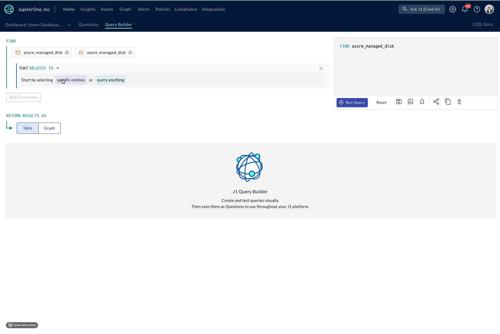
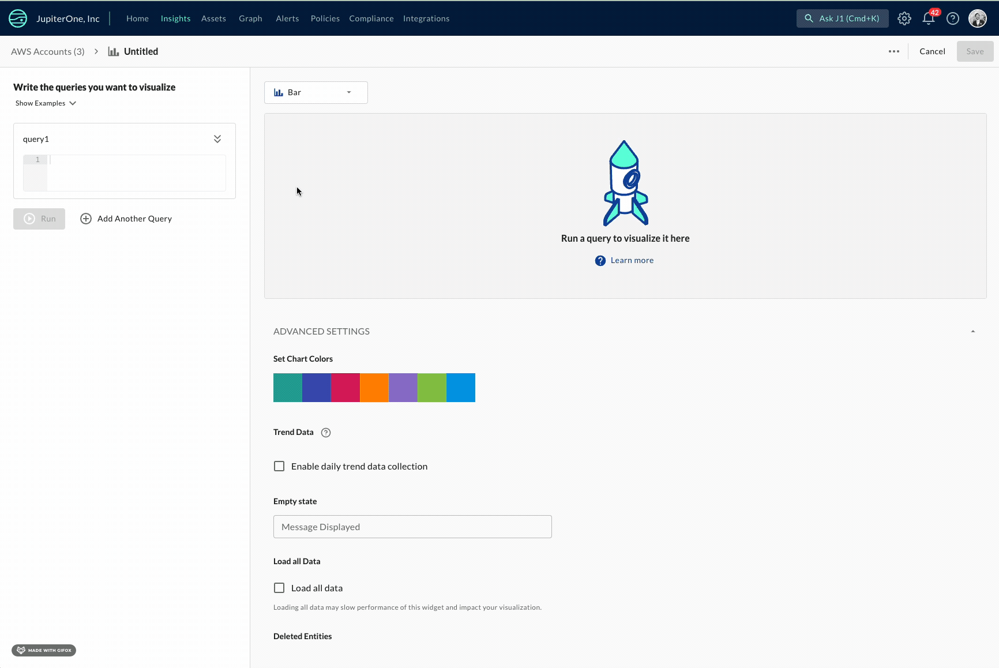
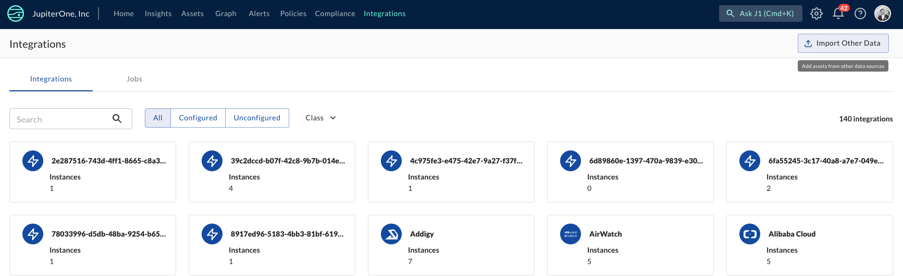
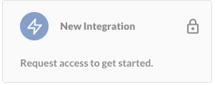

# JupiterOne April 2023 Release

## New Features and Improvements

- Alert on only new outcomes for rules: you can now elect to receive an alert when your rule produces a new outcome that has not been seen before. This means you are able to efficiently monitor what matters and stay up-to-date with any new developments.
- You can now download your policies in HTML format, in addition to other existing formats supported by J1.
- When writing queries with J1 Query Builder, only data with relationships to the root class/entity are shown. This shows you directly the classes and entities available to you and reduces the noise of what is in your environment to only show you the possible options. 
  
  
  
- You can now preview your J1 Insights charts while editing or creating new widget queries, allowing you to see how your query is represented so that you can make adjustments before publishing.  
  
    
  
- The bar charts in Insights are now able to be oriented in horizontal format.
- Your query results are now equipped with column filters. This leads to more performant queries and allows you to focus on the data that matters.
- Uploading integrations via csv files just got easier with a new csv upload process. 

  

- J1 Settings has a new look-and-feel that makes managing your profile, API keys, and user management easier. Key highlights include:
  - The ability to change your profile picture. 
  - Improved search capabilities for managing users and groups.
  - Robust user management, including a full view of a user and their permissions, along with the groups they belong to.
- Integrations that are currently in an early access phase are now visible within Integrations in the Platform. This gives you visibility into what new integrations are coming, as well as an opportunity to opt-in for early access use. 
  
   

## Integrations

#### Tenable

- Created a relationship between tenable_vulnerability_finding and vsphere_host.

#### Qualys

- Created a relationship qualys_host_finding < HAS - azure_vm. 

