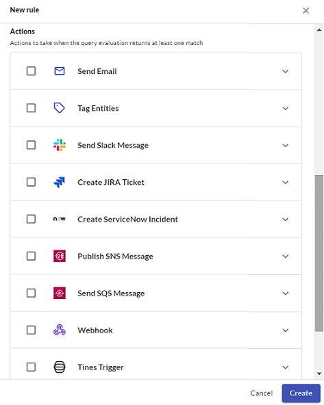

# Alerts and Alert Rules

JupiterOne allows you to configure rules using any J1QL query for continuous auditing and threat monitoring. You do this in J1 **Alerts**.

## Import Alert Rules from Rule Pack

You must have at least one active rule to trigger any alert. The easiest way to add some rules is to import rule packs.

1. From the top navigation of the J1 Search homepage, select **Alerts**.

2. Click **Manage Rules**.
   ​
   

   

3. Click **Import Rules**.
  
  
   
   ​
   
4. From the Import Rules window, select the rule packs or individual rules within a rule pack, and click **Import**. 

   

    

## Create Custom Alert Rules

To create your own custom rule:

1. From the top navigation of the J1 Search homepage, select **Alerts**.

2. Click **Manage Rules**.

3. Click **New Rule**.

4. Enter/select the following details for the custom rule and click Create:

   - Name
   - Description
   - Severity
   - Polling interval
   - Tags
   - Query (any J1QL query)
     ​
   
    

The custom rule you have added is evaluated daily, hourly, or with streaming evaluation for Enterprise customers. If the query you have specified in the rule returns at least one match, it triggers an alert.

## Additional Alert Options

J1 provides the ability to trigger the following actions when the query evaluation returns at least one match:

- Email: You provide the email addresses to alert and what you want in the email message.
- Slack: You must configure the Slack integration for JupiterOne by [following these instructions](../APIs_and-integrations/workflow/graph-slack.md). Ensure that you specify the channel in the format `#channel`.
- JIRA: You must configure the JIRA integration for JupiterOne by [following these instructions](../APIs_and-integrations/workflow/graph-jira.md). When you create a rule that triggers the creation of a Jira ticket, you provide the following:
  - Summary: title of the Jira ticket
  - Description: J1 automatically lists the affected entities and the associated query, but you can edit this field to contain other information.
  - Project: ID of the Jira project to which you want to assign the ticket.
  - Issue Type: type of issue you want the Jira ticket to be, such as task or bug.
  - Entity Class: (mandatory field) the class of the new ticket entity that you want to assign to the ticket, such as vulnerability or policy.
  - Integrations Instance: select the Jira instance from the dropdown menu.
  - Additional Fields: you can add any other of the Jira ticket fields if you want to return that information. 

- ServiceNow: Select the integration instance from the dropdown menu and enter the content for the request body. The message body is sent to the `/api/now/table` incident endpoint. Go to the REST API Explorer page in your ServiceNow deployment to learn about additional fields. The request automatically assigns the number property to be `j1:{rule-instance-id}`.
- SNS: The AWS account you want to send to must be configured as an AWS Integration, and the J1 IAM role for the AWS account you want to publish to must have the `SNS:Publish` permission.
- SQS: The AWS account you want to send to must be configured as an AWS Integration, and the J1 IAM role for the AWS account you want to publish to must have the `SQS:SendMessage` permission.

To trigger any of these workflows, when creating a custom rule, scroll down to the Additional Alerts section. Select the one you want and provide the required information.

 

You can also use templates when adding rules. The template goes inside any property under the operations property for a rule. Templates can contain JavaScript-like syntax that have input variables automatically inserted for usage. See the [alert rule schema](../APIs/alert-rule-schema.md) for more information about the templates property.

 

## Managing Alerts

J1 evaluates the rules you create each day, or at the custom interval of every 30 or 60 minutes, if specified.

To see a list of the active alerts that match the evaluation criteria of the alert rules, go to **Alerts**/Manage Rules.

Use the icons in the rows to edit, run, evaluate, toggle status, delete, or disable a rule.

## Configure Daily Notification Email

To receive daily notification of new and active alerts:

1. In J1 Alerts, go to **Manage Rules > Email Reports**.
2. Enter the email addresses of the users or teams in the daily and weekly recipients fields, with one address per line.
3. Ensure that `@jupiterone.io` and`@us.jupiterone.io` are in the allowlist in your email configuration.
